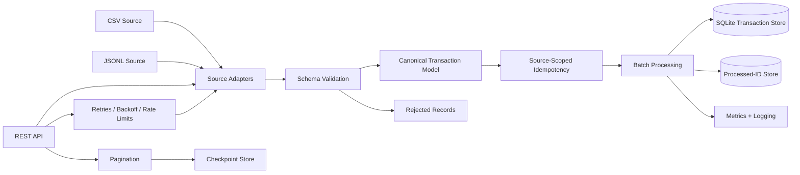

# Enterprise Banking Data Ingestion Service


## Architecture



### Processing Flow

```text
Source
  ↓
Source Adapter
  ↓
Pydantic Validation
  ↓
Canonical Transaction
  ↓
Source-Scoped Duplicate Detection
  ↓
Batch Processing
  ↓
Transactional Persistence
  ↓
Idempotency Marker
  ↓
Checkpoint Advancement
```

For API ingestion, checkpoints advance **only after the page's transactions have been safely persisted**.

---

## Key Features

- CSV, JSONL, and REST API ingestion
- Streaming file readers using Python generators
- Source-specific adapters behind a common interface
- Pydantic schema validation
- Canonical transaction data model
- `Decimal` monetary values
- Rejected-record capture with validation details
- REST API pagination
- Configurable HTTP timeouts and retries
- Exponential retry backoff
- HTTP `429 Retry-After` handling
- Checkpoint-based API restart and resume
- Source-scoped idempotency
- Batch duplicate detection
- Batch database persistence
- Composite transaction identity:
  `(source_system, transaction_id)`
- Crash-safe retry behavior
- Transactional batch rollback
- SQLite schema migration support
- Structured logging and ingestion metrics
- Unit and integration test coverage

---

## Source-Scoped Identity

Transaction IDs are not assumed to be globally unique.

Two systems may legitimately generate the same local transaction ID:

```text
BANK_A : 12345
BANK_B : 12345
```

The service therefore creates a source-scoped idempotency key:

```text
BANK_A:12345
BANK_B:12345
```

The destination database also uses:

```text
PRIMARY KEY (source_system, transaction_id)
```

This prevents false duplicate detection across independent sources.

---

## Reliability Design

The ingestion service differentiates between **record-level failures** and **source-level failures**.

### Record-level failure

```text
Invalid transaction
      ↓
Rejected
      ↓
Written to rejected JSONL
      ↓
Pipeline continues
```

### Temporary API failure

```text
Timeout / 429 / 500 / 502 / 503 / 504
      ↓
Retry
      ↓
Exponential backoff
```

### Database batch failure

```text
Batch write fails
      ↓
Database transaction rolls back
      ↓
Idempotency is NOT advanced
      ↓
Checkpoint is NOT advanced
```

### Crash after destination write

The destination uses retry-safe conflict handling. If a transaction was persisted but the application crashed before its idempotency marker was written, a restart safely recognizes the existing destination row and repairs the processed state.

---

## Performance

The service was benchmarked using a **100,000-record PaySim transaction dataset**.

| Configuration | Runtime | Throughput |
|---|---:|---:|
| Single-record SQLite writes | ~34.2 s | ~2.9K records/sec |
| Batch size 100 | ~1.17 s | ~85K records/sec |
| Batch size 500 | ~0.74 s | ~136K records/sec |
| Batch size 1000 | ~0.69 s | ~144K records/sec |
| Full pipeline before idempotency batching | ~40.0 s | ~2.5K records/sec |
| Full optimized pipeline | ~1.0 s | ~100K records/sec |

Batching destination and idempotency operations reduced end-to-end processing time from roughly **40 seconds to ~1 second** for 100K records.

---

## Project Structure

```text
enterprise-banking-data-ingestion/
│
├── app/
│   ├── ingestion/
│   │   ├── base.py
│   │   ├── csv_adapter.py
│   │   ├── json_adapter.py
│   │   ├── api_adapter.py
│   │   ├── csv_reader.py
│   │   ├── jsonl_reader.py
│   │   └── factory.py
│   │
│   ├── models/
│   │   ├── transaction.py
│   │   ├── paysim.py
│   │   ├── partner_json.py
│   │   ├── adapter_record.py
│   │   ├── ingestion_result.py
│   │   └── page_complete.py
│   │
│   ├── transformation/
│   │   ├── paysim.py
│   │   └── partner_json.py
│   │
│   ├── services/
│   │   └── ingestion_service.py
│   │
│   ├── checkpoint.py
│   ├── config.py
│   ├── idempotency.py
│   ├── sqlite_idempotency.py
│   ├── sqlite_sink.py
│   ├── sinks.py
│   ├── validation.py
│   └── logging_config.py
│
├── data/
├── scripts/
├── tests/
├── Dockerfile
├── .dockerignore
├── .env.example
├── requirements.txt
├── main.py
└── pytest.ini
```

---

## Configuration

Configuration is loaded through environment variables using `pydantic-settings`.

Example:

```env
SOURCE_TYPE=csv
SOURCE_SYSTEM=PAYSIM

INPUT_FILE_PATH=data/transactions.csv
REJECTED_FILE_PATH=data/rejected/rejected_transactions.jsonl

API_URL=http://localhost:8000/data/api_transactions.json
API_TOKEN=

CHECKPOINT_FILE_PATH=data/state/api_checkpoint.json

IDEMPOTENCY_DATABASE_PATH=data/state/idempotency.db
TRANSACTION_DATABASE_PATH=data/output/transactions.db

BATCH_SIZE=500

API credentials are supplied through environment variables and are never hard-coded. The local `.env` file is excluded from Git and Docker images.
```

Supported source types:

```text
csv
json
api
```

---

## Running the Project

---

## Docker

The service can also run inside a Docker container using Python 3.10 and the dependencies defined in `requirements.txt`.

### Build the image

```bash
docker build -t enterprise-banking-data-ingestion .
```

### Run CSV ingestion

```bash
docker run --rm \
  -e SOURCE_TYPE=csv \
  -e SOURCE_SYSTEM=PAYSIM \
  -e INPUT_FILE_PATH=data/transactions.csv \
  -e REJECTED_FILE_PATH=data/rejected/rejected_transactions.jsonl \
  -e IDEMPOTENCY_DATABASE_PATH=data/state/idempotency.db \
  -e TRANSACTION_DATABASE_PATH=data/output/transactions.db \
  -e BATCH_SIZE=500 \
  enterprise-banking-data-ingestion
```

### Persistent state

SQLite databases and rejected-record output can be persisted outside the container using mounted directories:

```bash
mkdir -p docker-data/state docker-data/output docker-data/rejected

docker run --rm \
  -e SOURCE_TYPE=csv \
  -e SOURCE_SYSTEM=PAYSIM \
  -e INPUT_FILE_PATH=data/transactions.csv \
  -e REJECTED_FILE_PATH=data/rejected/rejected_transactions.jsonl \
  -e IDEMPOTENCY_DATABASE_PATH=data/state/idempotency.db \
  -e TRANSACTION_DATABASE_PATH=data/output/transactions.db \
  -e BATCH_SIZE=500 \
  -v "$(pwd)/docker-data/state:/app/data/state" \
  -v "$(pwd)/docker-data/output:/app/data/output" \
  -v "$(pwd)/docker-data/rejected:/app/data/rejected" \
  enterprise-banking-data-ingestion
```

The application runs as a non-root user inside the container. Secrets such as API tokens are supplied at runtime and are not included in the Docker image.

### CSV

```bash
SOURCE_TYPE=csv \
SOURCE_SYSTEM=PAYSIM \
INPUT_FILE_PATH=data/transactions.csv \
python main.py
```

### JSONL

```bash
SOURCE_TYPE=json \
SOURCE_SYSTEM=PARTNER_FILE \
INPUT_FILE_PATH=data/partner_transactions.jsonl \
python main.py
```

### REST API

Start the local test API:

```bash
python -m http.server 8000
```

Then run:

```bash
SOURCE_TYPE=api \
SOURCE_SYSTEM=PARTNER_API \
API_URL=http://localhost:8000/data/api_transactions.json \
python main.py
```

---

## Example Output

```text
Ingestion Summary
-----------------
Accepted transactions: 99703
Rejected transactions: 297
Duplicate transactions: 0
Total amount: 16471257786.54
Transaction types: {
    'CASH_OUT': 34990,
    'PAYMENT': 35298,
    'CASH_IN': 20846,
    'TRANSFER': 7871,
    'DEBIT': 698
}
Fraud transactions: 0
Fraud amount: 0
Fraud percentage: 0.00%
```

---

## Tests

Run the full test suite:

```bash
pytest -v
```

Current test suite:

```text
39 tests passing
```

Coverage includes:

- validation failures
- CSV ingestion
- JSONL ingestion
- API ingestion
- HTTP retries
- rate limiting
- pagination
- checkpoint recovery
- duplicate detection
- restart recovery
- batch processing
- database rollback
- sink constraint failures
- source ID collisions
- schema migration
- source-scoped checkpoint isolation
- API Bearer authentication
- API token propagation through the adapter factory

---

## Technology

- Python 3.10+
- Pydantic
- pydantic-settings
- HTTPX
- SQLite
- Pytest

---

## Current Design Trade-Off

The destination transaction store and processed-ID store are currently separate SQLite state stores.

Retry-safe destination writes and idempotency repair protect against the primary crash scenarios, but a larger distributed production system would typically use a shared transactional database, transactional outbox, or equivalent coordination strategy for stronger cross-system atomicity.

---

## Purpose

This project demonstrates production-oriented data engineering concepts including:

**streaming ingestion, schema validation, adapters, canonical modeling, API resilience, pagination, checkpointing, idempotency, database transactions, batching, atomicity, crash recovery, schema migration, observability, testing, and performance optimization.**
